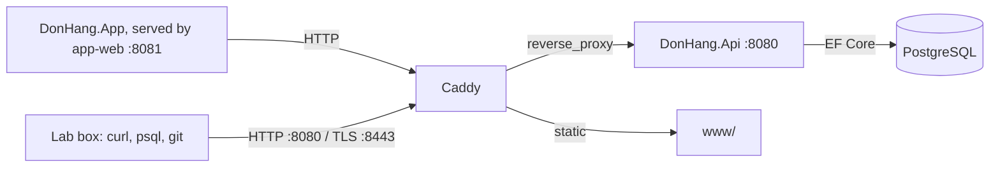

# Đơn Hàng at tag `stage-1`

## What exists at this tag

`scripts/up.sh` builds the Flutter web app, then starts the lab: Docker
Desktop and Flutter are the two prerequisites.

- **`DonHang.Api`**, a 3-layer ASP.NET Core API (`DonHang.Domain` entities and
  `OrderService`, `DonHang.Infrastructure` EF Core repository and
  `DonHangDbContext`, `DonHang.Api` controllers and middleware). JWT login
  (`POST /api/v1/auth/login`), products (`GET /api/v1/products(/{id})`) and
  orders (`POST /api/v1/orders`, `GET /api/v1/orders/{id}`,
  `PATCH /api/v1/orders/{id}/cancel`). Password hashing uses
  `Rfc2898DeriveBytes.Pbkdf2`; errors are RFC 9457 problem+json via a custom
  exception-handling middleware; every request is logged by a second,
  reusable middleware.
- **Caddy** (`web`) now reverse-proxies `/api/v1/*` to `api`; Kestrel is never
  exposed directly. The fixed non-API paths from `stage-0`
  (`/login.html`, `/admin`, `/cached.html`, `/redirect`, `/conflict`, `/slow`)
  are unchanged.
- **`DonHang.App`**, a Flutter web client (product list, sign-in, place an
  order), served as static files by a new `app-web` container on `:8081`.
- **`DonHang.Tests`**, xUnit tests for `OrderService` against a fake
  repository and a fake notifier. The suite is deliberately silent about
  cancelling a `shipped` order — `OrderService.CancelOrderAsync` still allows
  it; `management.l1.reading-a-300-line-pr` is about finding that gap by
  reading, not by running the tests.
- **`samples/DonHang.Samples/Samples/Design/`**: four SOLID counter-examples
  (an if/else shipping-fee chain, a subtype that breaks its base contract, a
  fat notifier interface, a notifier caller that depends on the concrete
  `EmailNotifier` instead of `INotifier`).
- **PostgreSQL**: `db/schema.sql` is unchanged (it still bootstraps a fresh
  container); every schema change from here on is an EF Core migration.
  `AddPasswordHashToCustomers` adds the column and backfills the 5 seeded
  customers with one fake dev password (`donhang-dev-password`).

Outputs live in `outputs/stage-1/`, same mechanism as `stage-0`.

## Data flow

## Changed since `stage-0`

`stage-0` had a lab and a database with no application; every `/api/v1/*`
answer was a fixed Caddy response. `stage-1` replaces those with a real,
3-layer API backed by the same database, a Flutter client that calls it, and
an EF Core migration history that starts truthfully from this tag's schema.

## What a lesson can learn from each new place

| Path | What a lesson learns from it |
|---|---|
| `DonHang.Domain/*`, `DonHang.Infrastructure/*` | layers, DI, EF Core mapping, migrations, the repository interface |
| `DonHang.Api/Controllers/*`, `Program.cs` | REST resources, DTOs, status codes, middleware order, JWT |
| `DonHang.Api/Middleware/*` | exception handling, structured logging |
| `DonHang.Tests/*` | test doubles, a fake repository, what a green suite does not prove |
| `samples/DonHang.Samples/Samples/Design/*` | SOLID violations, contrasted with `Samples/Oop/*` |
| `DonHang.App/lib/*` | the widget tree, state, calling an API with `package:http` |
| `Caddyfile`, `docker-compose.yml` | reverse proxy, Docker images and layers, volumes, networks, Compose |
| `scripts/dev-secrets.sh` | secrets vs. config, where a JWT signing key lives |
| `docs/team/kanban-board-example.md` | Kanban, alongside `docs/team/sprint-example.md`'s Scrum |

The authoritative list of files this tag must contain is
`tools/validate --manifest 1` in the curriculum repository.
