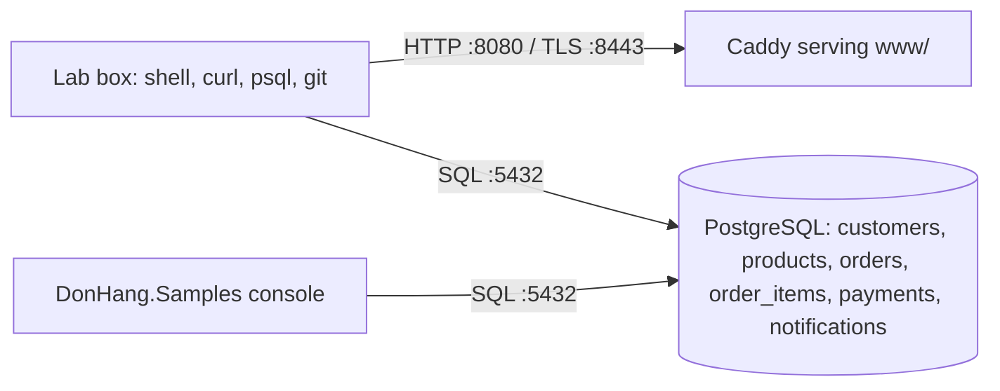

# Đơn Hàng at tag `stage-0`

## What exists at this tag

No application yet. `scripts/up.sh` starts the lab and is the only command you
need: Docker Desktop is the single prerequisite.

- A **lab box** (`lab`), a small Linux machine with a shell, `curl`, `openssl`,
  `git`, `psql` and an SSH server on port 2222. Every script under `scripts/`
  runs there, so the output is the same on Windows, macOS, Linux and CI. The
  line `[ -f /.dockerenv ] || exec .../lab-run.sh "$0"` near the top of each
  script is what puts it there; the lesson content starts on the line after it.
- **Caddy** (`web`) shares the lab box's network, so `localhost:8080` means the
  same thing everywhere. It serves `www/` and answers a fixed set of API paths
  with real status codes, cookies and cache headers. HTTPS is on
  `https://donhang.local:8443` with a certificate Caddy signs itself; add
  `127.0.0.1 donhang.local` to your hosts file to open it in a browser.
- **PostgreSQL 17** (`db`) on port 5432, created from `db/schema.sql` and
  `db/seed.sql`: 8 products, 5 customers (one of whom never ordered), 12 orders.
- **`samples/DonHang.Samples`**, a console project with one file per lesson
  under `Samples/<Module>/`, plus `DonHang.Samples.Tests`.
- **`git-playground/build-history.sh`**, which builds a throwaway repository
  with fixed authors and dates, so every commit id in the Git lessons is the
  same for everyone.

Outputs live in `outputs/stage-0/`, captured by `scripts/capture-output.sh`,
which replaces the parts that change on every run (`Date`, `Etag`, certificate
dates, process ids, source paths) using `outputs/unstable.regex`. CI runs every
script and fails if any captured output differs.

## Data flow

## Changed since the previous tag

First tag.

## What a lesson can learn from each place

| Path | What a lesson learns from it |
|---|---|
| `db/schema.sql` | tables, primary and foreign keys, one-to-many, the joining table |
| `db/seed.sql` | the fixed rows every SQL lesson quotes |
| `db/queries/*.sql` | one query file per SQL lesson: SELECT, JOIN, GROUP BY, writes, indexes, transactions, time zones |
| `Caddyfile` | the status codes, cookie attributes, cache headers and TLS the HTTP lessons assert |
| `www/*.html` | the pages those requests fetch |
| `scripts/computer/*.sh` | processes and ids, paths and permissions, the environment |
| `scripts/terminal/*.sh` | navigation, pipes and redirects, a script with arguments, SSH |
| `scripts/network/*.sh` | ports and listeners, DNS, TCP outcomes, a certificate |
| `scripts/http/*.sh` | a raw request, methods, status codes, cookies, caching, JSON |
| `scripts/sql/*.sh` | running a query and reading a plan |
| `scripts/git/*.sh` | commits, branches, merge, rebase, conflicts, blame, reflog, bisect |
| `scripts/debug/*.sh`, `scripts/craft/*.sh` | a stack trace; meeting a codebase |
| `samples/DonHang.Samples/Samples/*` | memory, async, OOP, collections, complexity, naming, small functions, smells, two bugs |
| `docs/*/*.md` | quotable Vietnamese prose: a sprint, a story, review comments, meeting notes, templates, a reading order |

The authoritative list of files this tag must contain is
`tools/validate --manifest 0` in the curriculum repository.
