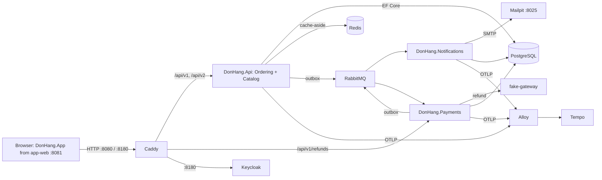

# Đơn Hàng at tag `stage-3`

## What exists at this tag

`scripts/up.sh` still starts the lab: it runs `scripts/dev-secrets.sh`,
builds the Flutter web app, then `docker compose up --build --wait`. Without a
profile that starts the API, its two new services, their databases, RabbitMQ,
Keycloak, Redis, Mailpit and the lab box.

- **A modular monolith with two services split off.** `DonHang.Api` holds
  two modules: Ordering (`DonHang.Domain`, `DonHang.Infrastructure`) and
  Catalog (`DonHang.Catalog`, reached only through `ICatalog`);
  `ModuleBoundaryTests` keep the boundaries. Order emails moved to
  `DonHang.Notifications` and refunds to `DonHang.Payments`, each with a
  database of its own (`donhang_notifications`, `donhang_payments`). The
  tag shows both shapes at once on purpose: the lessons about a notification
  module inside the process quote `stage-2`.
- **Domain model**: `Order` raises domain events, dispatched by
  `DomainEventDispatcher` before `SaveChangesAsync`; `Vnd` is a value object;
  `RecordOrderStatusHistory` writes the read model `order_status_history`
  behind `GET /api/v1/orders/{id}/history`.
- **Messaging**: RabbitMQ (`rabbitmq`, management UI on `localhost:15672`),
  the shared project `DonHang.Messaging` (outbox, relay, inbox), a quorum
  queue with a dead-letter queue per service.
- **Refund saga**: `POST /api/v1/orders/{id}/refund` returns `202`; Payments
  calls `fake-gateway` (a stand-in for the chosen gateway, see
  `docs/team/payment-gateway-evaluation.md`) through `GatewayRefundClient`,
  with retries, a timeout and a circuit breaker; staff list failed refunds at
  `GET /api/v1/refunds?status=failed`.
- **Resilience**: rate limiting on placing orders (`429` with
  `Retry-After`), a concurrency limit on the product list, jittered backoff.
- **Observability**: OpenTelemetry traces from every service to Tempo through
  Alloy, trace ids in the JSON logs, queue backlog panels.
- **Data**: PostgreSQL archives its WAL to the volume `wal-archive`; the
  one-shot service `db-init` creates the databases `keycloak` and
  `donhang_tofu`; Keycloak keeps its data in `keycloak` (still `start-dev`);
  `scripts/devops/` takes logical and base backups into the volume
  `backups`, restores them and recovers to a point in time; lab databases
  for tenancy, partitioning and sharding live under `db/`.
- **`DonHang.App`**: a design system (`lib/design/`: tokens, a
  `ThemeExtension`, components, brands) with a gallery
  (`lib/gallery_main.dart`), accessibility and golden tests; products
  cached for offline use and orders queued while the API does not answer
  (`lib/offline/`).
- **Supply chain**: NuGet and pub lock files, every action and base image
  pinned by digest, Dependabot, an SBOM and a vulnerability scan per image,
  images signed with Cosign and attested in CI, `verify-image.sh` and
  `deploy-verified.sh`.
- **Infrastructure as code and GitOps**: OpenTofu creates the kind cluster
  `donhang-staging` and its platform (`deploy/tofu/`), state in PostgreSQL;
  Argo CD in that cluster syncs the config repository
  (`deploy/gitops/config-repo/`, later the Kustomize layout of
  `config-repo-kustomize/`) from a Git server in the cluster; secrets are
  sealed before they enter that repository.
- **Kubernetes**: Helm, Ingress and the Gateway API with TLS on staging,
  StatefulSets with claims, RBAC, Pod Security, NetworkPolicies and an
  admission policy; on the cluster `donhang` the networking internals,
  MetalLB, a CRD, cert-manager issuing a certificate with the lab CA, etcd
  snapshots, encryption at rest and draining nodes.
- **Team docs**: ADRs in `docs/adr/`, a tech debt register, a vendor
  evaluation, the list of components the team runs itself, the refund and
  order history designs.

## Prerequisites

Docker Desktop, Flutter 3.47 and Bash (Git Bash on Windows) for the lab;
.NET SDK 10.0.300 (`global.json`) to run the tests, which also need Docker.
On Windows and macOS run `flutter test --exclude-tags golden`: the golden
images are made on Linux (ubuntu-24.04) and compared only there; refresh
them with the workflow `update-goldens.yml`.

The scripts marked `# Runs on the host` need, on the host:

- kind v0.33.0 and kubectl 1.34 (`scripts/k8s/`, as at `stage-2`).
- OpenTofu 1.10 (`scripts/devops/tofu-*.sh`, `dr-drill.sh`).
- kubeseal 0.40 (`seal-secrets.sh`, `sealed-secrets-install.sh`,
  `rotate-db-password.sh`).
- Helm 3.19 (`helm-template.sh`, `helm-release.sh`, `traefik-install.sh`,
  `traefik-ha.sh`).
- Nothing for Syft, Grype or Cosign: `sbom.sh`, `scan-image.sh` and
  `verify-image.sh` run them in containers pinned by digest. The GitHub CLI
  is not needed.

Network: `verify-image.sh` and `deploy-verified.sh` need `ghcr.io` and
Sigstore (`rekor.sigstore.dev`, `fulcio.sigstore.dev`); without them they
stop. CI signs the six images the `publish` job pushes (api, migrate,
notifications and its migrate, payments and its migrate); `fake-gateway` is
built, scanned and given an SBOM, but neither pushed nor signed. Dependabot
runs only on GitHub, not in the lab.

Every script reads `.env` and `secrets/`, so run `scripts/dev-secrets.sh`
(or `up.sh`) first. From stage-3 it also writes `RABBITMQ_PASSWORD`,
`GATEWAY_API_KEY`, `TOFU_STATE_PASSPHRASE` and `GITEA_ADMIN_PASSWORD`, the
sealing key pair (`secrets/sealing.*`), a lab CA and the gateway's
certificate (`secrets/lab-ca.*`, `secrets/donhang-tls.*`, 825 days) and
`secrets/encryption-config.yaml` (a `secretbox` key, then `identity`).
Nothing under `secrets/` or `backups/` is committed.

## Compose profiles and volumes

| Profile | Services | What for |
|---|---|---|
| none | lab, web, db, db-init, migrate, api, redis, mailpit, rabbitmq, notifications(-migrate), payments(-migrate), fake-gateway, keycloak, app-web | everything the app needs |
| `monitoring` | prometheus, grafana, loki, alloy, tempo | `scripts/devops/` metrics and logs, the tracing scripts of `scripts/backend/` |
| `replica` | db-replica | a streaming replica 5 seconds behind (`replica-lag.sh`) |
| `pitr` | db-pitr | a recovery to a point in time; `pitr.sh` creates and removes it |

Volumes beyond `stage-2`: `rabbitmq-data`, `tempo-data`, `backups` (dumps
and base backups), `wal-archive` (gzipped WAL), `db-replica-data`,
`db-pitr-data`. `scripts/down.sh` removes them all.

## Clusters and their resources

All clusters are kind clusters on Docker Desktop; give Docker at least 12 GB
of memory to keep the lab, `donhang` and `donhang-staging` up together.

- `donhang` (one control plane, two workers, about 3.5 GB): the `stage-2`
  lessons and, from stage-3, the storage, networking, bare-metal and
  lifecycle lessons. Those leave MetalLB, cert-manager 1.20.4, the namespaces
  `network-lessons`, `ha-lessons` and `operator-lessons` and the container `donhang-lb-client` behind. Docker Desktop does not route from the host
  to the `kind` network: a LoadBalancer address is reached from
  `donhang-lb-client`, a container attached to that network.
- `donhang-staging` (one node, about 4 GB with Argo CD, the Git server,
  Keycloak and the backend): created by `tofu-env.sh staging`, it publishes
  the Gateway on `127.0.0.1:18080` (HTTP) and `127.0.0.1:18443` (HTTPS) for
  `donhang.localhost` and `auth.donhang.localhost`. Trust
  `secrets/lab-ca.crt` to call it over HTTPS (with curl on Windows:
  `--cacert secrets/lab-ca.crt --ssl-no-revoke`). `tofu-teardown.sh
  --staging` removes it.
- `donhang-iac` (one node): the first OpenTofu lessons create and delete it.
- `donhang-ha` (three control planes; about 3 GB more memory while it
  runs) and `donhang-lifecycle` (one node): `control-plane-ha.sh`,
  `etcd-snapshot.sh` and `encryption-at-rest.sh` create and delete them;
  their kubeconfigs stay in `secrets/`, `~/.kube/config` is not touched.
  etcd snapshots are copied to `backups/etcd/`.

`dr-drill.sh` rebuilds staging with only the Application `apps/staging.yaml`;
Traefik, the edge and the policies come back with their own scripts.

## Data flow

```mermaid
flowchart LR
  B[Browser: DonHang.App from app-web :8081] -->|HTTP :8080 / :8180| C[Caddy]
  C -->|/api/v1, /api/v2| API[DonHang.Api: Ordering + Catalog]
  C -->|/api/v1/refunds| PAY[DonHang.Payments]
  C -->|:8180| K[Keycloak]
  API -->|EF Core| P[(PostgreSQL)]
  API -->|cache-aside| R[(Redis)]
  API -->|outbox| MQ[RabbitMQ]
  MQ --> N[DonHang.Notifications]
  MQ --> PAY
  PAY -->|outbox| MQ
  PAY -->|refund| GW[fake-gateway]
  N -->|SMTP| MP[Mailpit :8025]
  N --> P
  PAY --> P
  API & N & PAY -->|OTLP| A[Alloy] --> T[Tempo]
```

## Changed since `stage-2`

`stage-2` was one service run properly. `stage-3` splits it where the lessons
need a split: Catalog becomes a module with a contract, email and payments
become services joined by messages, and the refund flow of the stage-2 design
doc is built as a saga. Around the code, staging becomes a cluster created by
OpenTofu and deployed by Argo CD from a config repository, images are signed
and checked before deploy, and the team writes its decisions down as ADRs.
`QueuedNotifier`, `INotifier`, `NotificationQueue`, `NotificationSender`,
`MailKitEmailSender` (now in Notifications) and `ProductCache` in
Infrastructure (now in Catalog) are gone from the API; the old tables
`notifications` and `payments` stay in `donhang` (debt N1, N2, ADR 0008).

## Lessons at this tag

| Module | Lessons |
|---|---|
| backend/messaging | 7 |
| backend/sagas-and-consistency | 8 |
| backend/observability | 7 |
| backend/resilience | 6 |
| backend/multitenancy-and-sharding | 7 |
| design/ddd-tactical | 5 |
| design/modular-monolith | 5 |
| design/cqrs-event-sourcing | 7 |
| devops/iac | 7 |
| devops/gitops | 7 |
| devops/secrets-backup-dr | 6 |
| devops/supply-chain | 7 |
| frontend/performance-offline | 7 |
| frontend/design-system | 7 |
| k8s/ingress-helm | 8 |
| k8s/state-and-storage | 8 |
| k8s/security-and-policy | 8 |
| k8s/networking-deep | 8 |
| k8s/bare-metal | 8 |
| k8s/operators-and-cluster-lifecycle | 8 |
| management/tech-debt-and-adr | 8 |
| management/build-vs-buy-tco | 7 |

## Capturing outputs

`TAG=stage-3 scripts/capture-output.sh <script>` captures one script into
`outputs/stage-3/scripts/<module>/<name>.txt`, masked by
`outputs/unstable.regex`. The modes, each in the order of the lessons:

- `--all`: every script except `scripts/k8s/`, the host scripts of
  `--devops-host`, `verify-image.sh` (it checks an image CI pushes after the
  lab job) and `change-hotspots.sh` (it reads the whole Git history), against
  the running lab started with `COMPOSE_PROFILES=monitoring`. CI's `lab` job.
- `--k8s`: deletes `donhang`, runs the `stage-2` k8s scripts on a new one.
  CI's `k8s` job.
- `--devops-host`: the OpenTofu, GitOps, sealed secrets and disaster
  recovery scripts, ending with `deploy-verified.sh` (needs `ghcr.io` and
  Sigstore); recreates `donhang-staging`.
- `--k8s-host`: the stage-3 k8s scripts, on `donhang-staging` and then on
  `donhang`.

The last two, `verify-image.sh` and `change-hotspots.sh` run only on a
learner's machine; CI does not check their outputs.

## What a lesson can learn from each new place

| Path | What a lesson learns from it |
|---|---|
| `DonHang.Domain/DomainEvents.cs`, `IDomainEventHandler.cs`, `Vnd.cs`, `Entities.cs` | aggregates, value objects, domain events and their dispatch |
| `DonHang.Catalog/*`, `DonHang.Tests/Architecture/ModuleBoundaryTests.cs` | a module with a contract, owning its tables, tested boundaries |
| `DonHang.Messaging/*`, `DonHang.Notifications/*` | a message broker, outbox, relay, inbox, dead-letter queues, a service extracted |
| `DonHang.Payments/*`, `fake-gateway/*`, `docs/design/refund-design.md` | a saga, compensation, an anti-corruption layer, timeouts, a circuit breaker |
| `DonHang.Infrastructure/RecordOrderStatusHistory.cs`, `samples/DonHang.Samples/Samples/Design/EventSourcing/*`, `docs/design/order-history-design.md` | CQRS read models, event sourcing on a sample, when not to use it |
| `db/pg_hba.conf`, `db/databases.sql`, `db/replica/`, `db/pitr/`, `db/tenancy/`, `db/partitioning/`, `db/sharding/` | WAL archiving, replicas, point-in-time recovery, row-level security, partitions, shards |
| `DonHang.App/lib/design/*`, `lib/gallery/*`, `lib/offline/*`, `test/design/*` | tokens, theme extensions, components, a gallery, golden and accessibility tests, an offline queue |
| `.github/workflows/*`, `.github/dependabot.yml`, `**/packages.lock.json`, `.grype.yaml` | pinning by content, dependency updates, SBOMs, scanning, signing, provenance |
| `deploy/tofu/*` | OpenTofu resources, state, modules, environments, drift |
| `deploy/argocd/`, `deploy/gitops/*`, `deploy/sealed-secrets/` | pull-based deployment, sync order, self-heal, promotion, sealed secrets, overlays |
| `deploy/helm/lessons/`, `deploy/gateway-api/`, `deploy/metallb/`, `deploy/cert-manager/`, `deploy/k8s/lessons/*`, `deploy/k8s/bare-metal/` | Helm, Ingress and the Gateway API, storage, RBAC, Pod Security, policies, networking internals, bare-metal load balancing, CRDs, lifecycle |
| `scripts/backend/*`, `scripts/design/*`, `scripts/frontend/*`, `scripts/devops/*`, `scripts/k8s/*`, `scripts/management/*` | every command the stage-3 lessons show |
| `docs/adr/*` | ADRs: structure, options, proposing, superseding, TCO, lock-in, an exit plan |
| `docs/team/tech-debt-register.md` | a technical debt register, its interest, what was repaid |
| `docs/team/payment-gateway-evaluation.md` | a vendor evaluation, SLA turned into time, contract terms |
| `docs/team/self-run-components.md` | the recurring cost of running open source yourself |

The authoritative list of files this tag must contain is
`tools/validate --manifest 3` in the curriculum repository.
