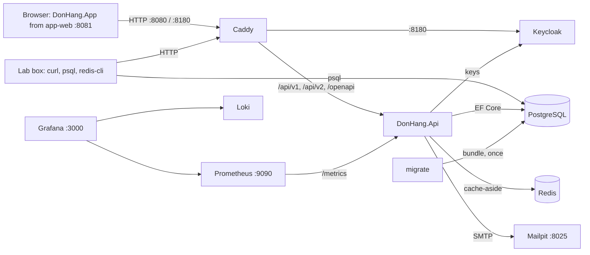

# Đơn Hàng at tag `stage-2`

## What exists at this tag

`scripts/up.sh` still starts everything: it runs `scripts/dev-secrets.sh`,
builds the Flutter web app, then `docker compose up --build --wait`.

- **Sign-in through Keycloak** (`keycloak`, published as `localhost:8180`
  through Caddy). The API no longer issues tokens: it validates Keycloak's
  access tokens, with the policies `StaffOnly` (role `staff`) and `OrderOwner`
  (the order's customer, or staff). Five customers and one staff account
  (`lan.do@example.com`) share the fake password `donhang-dev-password`.
- **API design**: offset pages and `maxPriceVnd` on products, cursor pages on
  orders, `/api/v2/orders` beside an unchanged `/api/v1/orders`, a problem
  `type` for each 409, `Idempotency-Key` on `POST /api/v1/orders`, a row
  version token, and the OpenAPI document at `/openapi/v1.json`.
- **Domain model**: `Order` owns its status rules (`Cancel`, `Ship`,
  `MarkPaid`) and is valid from its constructor; `DonHang.Domain` references
  no project and no package.
- **Redis** caches products through `ProductCache`, a decorator of
  `IProductRepository` (cache-aside, invalidation on `PATCH`, one loader per
  key).
- **Background job**: order emails are rows in `notifications`, claimed with
  `FOR UPDATE SKIP LOCKED` by `NotificationSender` and retried with backoff;
  they arrive in **Mailpit** (`localhost:8025`).
- **Migrations** run once in a `migrate` container (an EF Core migration
  bundle) before `api` starts; the API no longer migrates at startup.
- **Monitoring** (Compose profile `monitoring`): `/metrics`, Prometheus
  (`localhost:9090`), Grafana (`localhost:3000`) with one dashboard, JSON logs
  shipped by Alloy into Loki.
- **Tests**: `Order` unit tests, a dependency-rule test, and integration tests
  on real PostgreSQL and Redis (Testcontainers, `WebApplicationFactory`).
- **`DonHang.App`**: Riverpod state, go_router routes with deep links and a
  sign-in guard, Keycloak sign-in with PKCE, English and Vietnamese, a dark
  theme, a validated order form. `DonHang.App/README.md` is still Flutter's
  template text, on purpose (`management.l2.readme`).
- **CI/CD**: `.github/workflows/ci.yml` (tests, app, images, a staging run,
  publishing `sha-<commit>` images to GHCR, kubeconform, the k8s scripts on
  kind, the lab capture) and `release.yml` (a `v*.*.*` tag promotes images to
  `X.Y.Z`); `CHANGELOG.md`.
- **Kubernetes**: plain manifests under `deploy/k8s/` for a kind cluster (one
  control plane, two workers) and namespace `donhang`.
- **Team docs**: the refund flow, planned but not built: velocity history, a
  plan with three-point estimates and a buffer, a risk register, a stakeholder
  update, requirements and a design doc. A root `README.md` in Vietnamese.

## Prerequisites

Docker Desktop, Flutter 3.47 and Bash (Git Bash on Windows) for the lab;
.NET SDK 10.0.300 (`global.json`) to run the tests, which also need Docker.
The `scripts/k8s/` scripts run on the host and need kind v0.33.0 and kubectl
1.34 there; they read `.env`, so run `scripts/dev-secrets.sh` (or `up.sh`)
first.

## Data flow

```mermaid
flowchart LR
  B[Browser: DonHang.App from app-web :8081] -->|HTTP :8080 / :8180| C[Caddy]
  L[Lab box: curl, psql, redis-cli] -->|HTTP| C
  L -->|psql| P
  C -->|/api/v1, /api/v2, /openapi| API[DonHang.Api]
  C -->|:8180| K[Keycloak]
  API -->|keys| K
  API -->|EF Core| P[(PostgreSQL)]
  M[migrate] -->|bundle, once| P
  API -->|cache-aside| R[(Redis)]
  API -->|SMTP| MP[Mailpit :8025]
  PR[Prometheus :9090] -->|/metrics| API
  G[Grafana :3000] --> PR
  G --> LK[Loki]
```

## Changed since `stage-1`

`stage-1` was one 3-layer API that signed its own tokens, sent nothing in the
background and migrated itself at startup. `stage-2` hands sign-in to
Keycloak, moves the business rules into `Order`, adds a cache, a job queue,
versioned and paginated endpoints, and the machinery around the code (CI,
images, a release workflow, monitoring, a kind cluster), because the stage-2
lessons are about running one service properly before splitting it in
`stage-3`. `POST /api/v1/auth/login`, `AuthController`, `JwtTokenService`,
`PasswordHasher` and `MigrationBaseline.cs` are gone.

## Lessons at this tag

| Module | Lessons |
|---|---|
| backend/api-design | 8 |
| backend/oauth-and-authz | 7 |
| backend/caching | 4 |
| backend/background-jobs | 6 |
| backend/indexes-and-plans | 8 |
| design/gof-patterns | 7 |
| design/clean-hexagonal | 7 |
| design/domain-model | 8 |
| design/integration-testing | 8 |
| frontend/state-and-routing | 8 |
| frontend/forms-i18n-theming | 7 |
| devops/ci-cd | 8 |
| devops/release | 7 |
| devops/monitoring-basics | 8 |
| k8s/why-and-architecture | 7 |
| k8s/workloads | 8 |
| k8s/config-and-probes | 8 |
| management/planning-and-risk | 8 |
| management/technical-writing | 7 |

## Capturing outputs

`TAG=stage-2 scripts/capture-output.sh <script>` captures one script into
`outputs/stage-2/scripts/<module>/<name>.txt`, masked by
`outputs/unstable.regex`. `--all` runs every script except `scripts/k8s/`
against the running lab (start it with `COMPOSE_PROFILES=monitoring` for
`scripts/devops/`). `--k8s` deletes the kind cluster, runs the k8s scripts in
lesson order on a new one, and leaves it running
(`scripts/k8s/cluster-down.sh`). Scripts marked `# Runs on the host` run
outside the lab box.

## What a lesson can learn from each new place

| Path | What a lesson learns from it |
|---|---|
| `DonHang.Domain/Entities.cs`, `OrderStatusException.cs`, `OrderService.cs` | transaction script vs. domain model, status changes through methods, where a rule belongs |
| `DonHang.Domain/I*Repository.cs`, `IEmailSender.cs`, `INotifier.cs`, `OrderSummary.cs` | ports, the dependency rule, projections |
| `DonHang.Infrastructure/Ef*Repository.cs`, `DonHangDbContext.cs`, `Migrations/*` | no-tracking and projection queries, cursor pages, indexes, optimistic concurrency |
| `DonHang.Infrastructure/ProductCache.cs`, `ServiceCollectionExtensions.cs` | cache-aside, invalidation, stampede, the decorator pattern |
| `DonHang.Infrastructure/NotificationQueue.cs`, `QueuedNotifier.cs`, `MailKitEmailSender.cs`, `DonHang.Api/Jobs/NotificationSender.cs` | hosted services, a database job queue, retry with backoff, at-least-once, SKIP LOCKED, adapter |
| `DonHang.Api/Controllers/*`, `Controllers/V2/*`, `Dtos.cs` | pagination, filtering, breaking changes, versioning, idempotent endpoints |
| `DonHang.Api/Authorization/*`, `Program.cs`, `keycloak/donhang-realm.json`, `scripts/lib/keycloak.sh` | OAuth 2.0 roles, the code flow, OIDC, token validation, role- and resource-based access, the composition root |
| `DonHang.Api/Middleware/*`, `Monitoring/OrderMetrics.cs`, `appsettings.json` | problem types, JSON logs, counters |
| `DonHang.Tests/Domain/*`, `Architecture/*`, `Integration/*` | testing the entity, testing the dependency rule, Testcontainers, fixtures, `WebApplicationFactory`, protected endpoints |
| `DonHang.App/lib/providers.dart`, `router.dart`, `auth/*`, `screens/*`, `l10n/*`, `l10n.yaml`, `test/*` | Riverpod, go_router, deep links, route guards, theming, ARB messages, forms and server errors |
| `samples/DonHang.Samples/Samples/Design/CheckoutTotal.cs`, `ShippingFeeFactory.cs`, `OrderEvents.cs` | strategy, factory, observer |
| `db/queries/*`, `db/perf/fill.sql`, `db/migrations-baseline.sql` | query plans, composite indexes, a baseline for a database created from `schema.sql` |
| `DonHang.Api/Dockerfile`, `docker-compose.yml`, `Caddyfile`, `deploy/app-web/Caddyfile`, `lab/Dockerfile` | the migrate stage, Redis, Mailpit, Keycloak, the monitoring profile, a single-page app host |
| `.github/workflows/*`, `CHANGELOG.md`, `scripts/release-notes.sh` | CI stages, quality gate, caches, artifacts, environments, registries, tags and digests, a release |
| `deploy/monitoring/*` | Prometheus scraping, PromQL, Grafana provisioning, Alloy and Loki |
| `deploy/k8s/*`, `deploy/k8s/lessons/*`, `scripts/k8s/*` | nodes, Pods, labels, ReplicaSets, Deployments, Services, rollouts, ConfigMaps, Secrets, probes, requests and limits |
| `scripts/backend/*`, `scripts/devops/*` | every command the backend and monitoring lessons show |
| `scripts/dev-secrets.sh` | fake dev secrets: Keycloak and Grafana admin passwords, no JWT key any more |
| `docs/team/velocity-history.md` | velocity per sprint, a forecast as a range, fewer people means fewer points |
| `docs/team/refund-plan-example.md` | three-point estimates, (O + 4M + P) / 6, one visible buffer line |
| `docs/team/risk-register-example.md` | a risk register, likelihood and impact, four kinds of response, one owner each |
| `docs/team/stakeholder-update-example.md` | who needs which part of a plan, an update in the reader's words |
| `README.md`, `DonHang.App/README.md` | a README that answers what, how to run, where next; one nobody rewrote |
| `docs/team/refund-requirements.md` | a requirements document, numbered checkable requirements, measurable non-functional ones, open questions with owners |
| `docs/design/refund-design.md` | a design doc: requirements answered, proposal, a rejected option, out of scope, open questions |

The authoritative list of files this tag must contain is
`tools/validate --manifest 2` in the curriculum repository.
